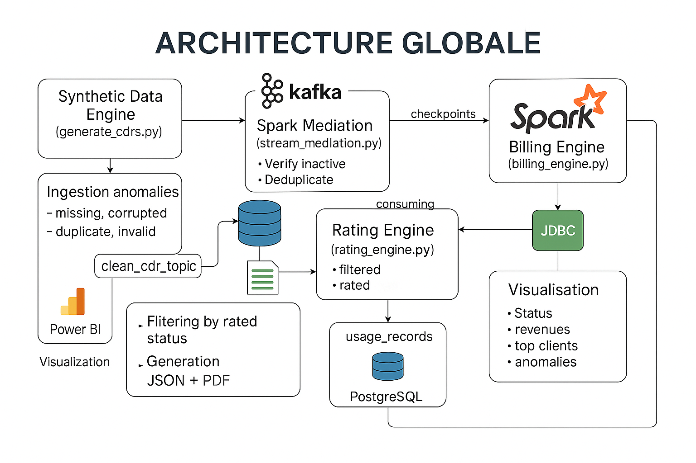

#  Pipeline Big Data pour Données Télécom

Ce projet implémente un pipeline Big Data **temps réel et batch** pour la gestion automatisée de données télécoms (CDR/EDR). Il couvre toutes les étapes de la chaîne de valeur des données : **génération, ingestion, médiation, tarification, facturation** et **visualisation**. Ce pipeline reflète une architecture moderne en Data Engineering, intégrant des technologies  comme **Kafka**, **Apache Spark**, **PostgreSQL** et des outils de génération de documents structurés (**PDF/JSON**).

> 💡 Ce projet met en lumière les compétences clés en traitement de flux, qualité des données, modélisation métier télécom et automatisation des processus analytiques.

---

##  Objectifs du projet

- Générer des CDR réalistes : appels, SMS, sessions data
- Injecter des anomalies pour tester la résilience du système
- Traiter les données en streaming avec Spark
- Appliquer des règles de tarification par service client
- Générer automatiquement des factures mensuelles (JSON & PDF)
- Visualiser les résultats : revenus, statuts d’enregistrements, top clients

---

## Architecture du Pipeline

---

##  Composants du Pipeline

### 🔹 Générateur de Données Synthétiques (`generate_cdr.py`)
- Génère CDR/EDR simulés avec une répartition (60 % voice, 30 % data, 10 % SMS)
- Structure enrichie : `record_type`, `timestamp`, `technology`, `msisdn`, etc.
- 5 % d’anomalies injectées (champ manquant, doublon, valeur corrompue)
- Export au format **JSON ligne par ligne**

### 🔹 Médiation en Streaming (`stream_mediation.py`)
- Lecture continue depuis **Kafka** (`telecom_cdr_topic`)
- Normalisation des identifiants (`caller_id`, `sender_id`, `user_id`) en `msisdn`
- Validation, enrichissement, suppression des doublons
- Séparation automatique :
  - ✅ Données valides → `clean_cdr_topic`
  - ❌ Données erronées → `error_topic`

### 🔹 Moteur de Tarification (`rating_engine.py`)
- Identification client actif via **PostgreSQL**
- Récupération du plan tarifaire (voice, SMS, data)
- Calcul du coût :
  - Appel → `durée × prix`
  - Data → `volume × prix`
  - SMS → `prix fixe`
- Ajout du statut `rated`, `error` ou `unmatched`
- Enregistrement dans la table `usage_records`

### 🔹 Moteur de Facturation (`billing_engine.py`)
- Filtrage des enregistrements tarifés avec timestamp valide
- Agrégation mensuelle des coûts par client
- Génération des factures au format :
  - 🧾 **JSON**
  - 📄 **PDF**
- Enregistrement dans le dossier `/invoices`

---

## 📊 Résultats

-  Pipeline robuste validé avec 10 000 événements
-  Revenus mensuels générés automatiquement
-  Clients à forte consommation facilement identifiables
-  Données exploitables pour reporting ou intégration BI

---

##  Technologies utilisées

| Outil / Langage     | Rôle dans le projet                            |
|---------------------|------------------------------------------------|
| **Ubuntu**    |     | Environnement de développement principal       |
| Python              | Scripts de génération, médiation, billing      |
| Apache Kafka        | Ingestion et transport en temps réel           |
| Apache Zookeeper    | Coordination du cluster Kafka                  |
| Apache Spark        | Traitement des données (Streaming & Batch)     |
| PostgreSQL          | Stockage des clients et CDR tarifés            |
| PDFKit / FPDF       | Génération de factures PDF                     |
| JSON                | Format standardisé des fichiers                |

